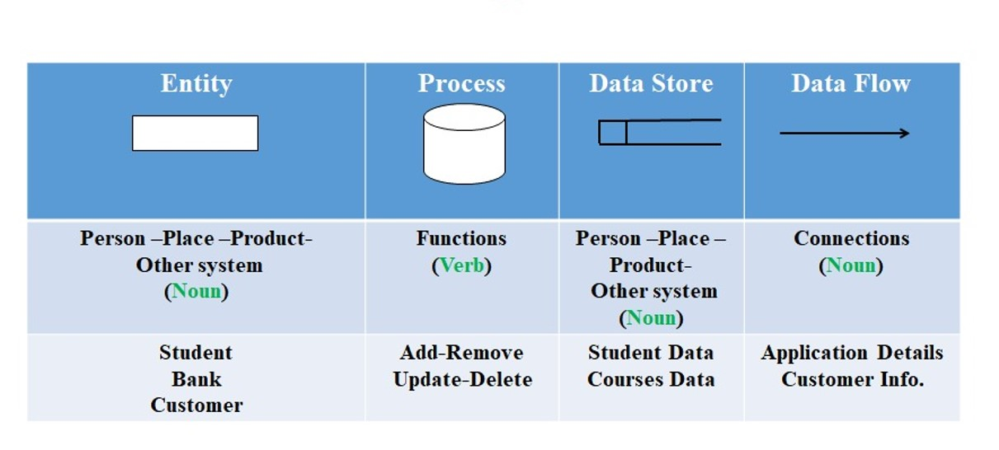
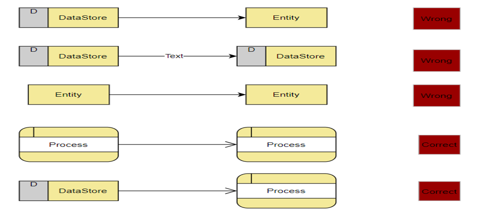
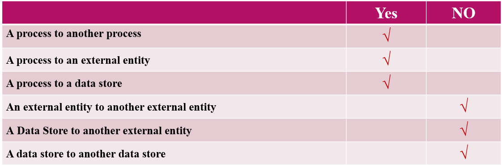
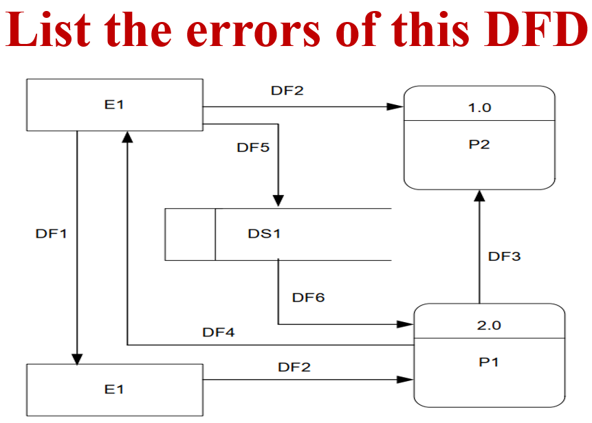
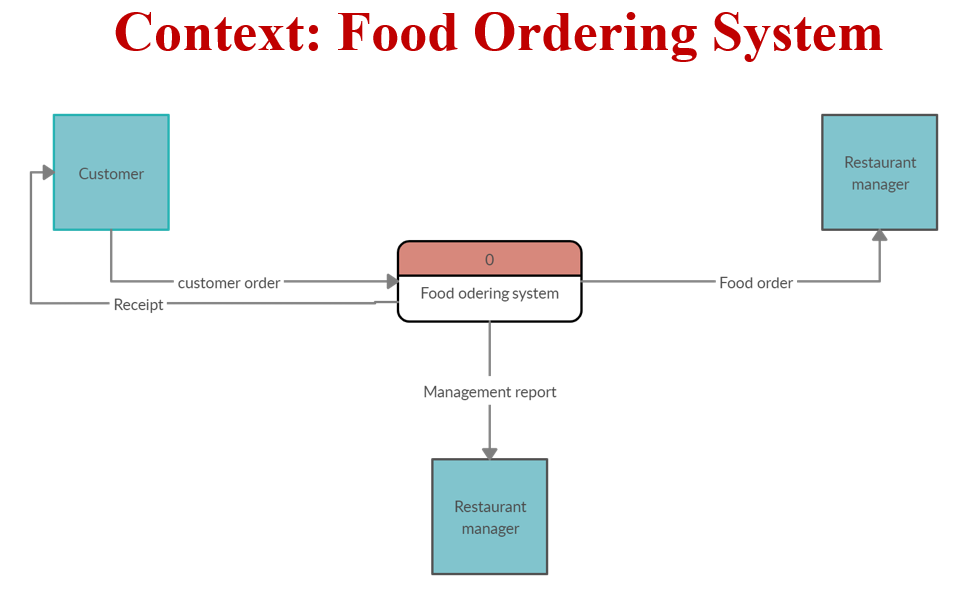
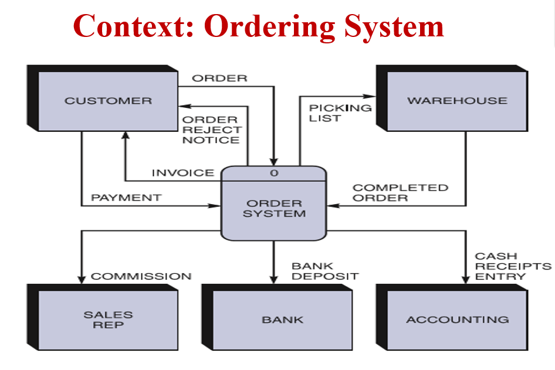
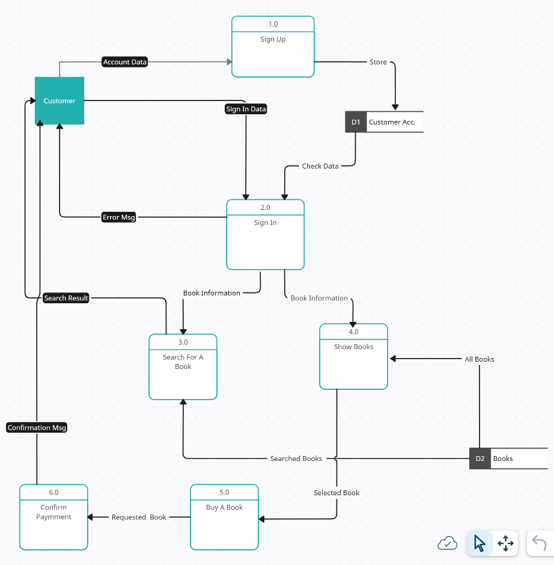

### Section 2

## Prepared By TA. Ahmed Arafat

### What Is Modeling In System Analysis?

Modeling in system analysis and design is the process of creating simplified representations of a system's structure,
processes, and interactions to better understand, analyze, and communicate how the system should function. Models
provide a way to visually or conceptually break down complex systems, making it easier to design, plan, and implement
solutions.

In system analysis and design, modeling serves several key purposes:

1. **Understanding Requirements**: Models help stakeholders (users, managers, and developers) better understand the
   system requirements by illustrating how different parts of the system should work together.

2. **Visualizing Structure and Behavior**: Through diagrams and flowcharts, models clarify the structural and behavioral
   aspects of a system, showing how data flows, processes operate, and components interact.

3. **Facilitating Communication**: Models create a common language that stakeholders can use to communicate effectively,
   reducing misunderstandings and ensuring everyone has a consistent view of the system.

4**Supporting Design and Implementation**: Models act as blueprints for developers and designers, providing guidance
for building the system in a structured and organized way.

Common modeling tools and techniques include:

- **Data Flow Diagrams (DFDs)**: Show data movement within the system.
- **Entity-Relationship Diagrams (ERDs)**: Represent data structures and relationships.

Modeling helps ensure that the system's design aligns with user needs and business objectives, ultimately leading to a
more efficient and functional system.

## Data Flow Diagram (DFD)

A **Data Flow Diagram (DFD)** is a graphical representation of the flow of data through a system, showing how inputs are
transformed into outputs. DFDs are used in systems analysis and design to visualize data processes, helping identify
where data originates, how it is processed, and where it ends up. By breaking down a system into its components, DFDs
allow for a clearer understanding of the system’s functionality.

### Components of DFD

DFDs consist of four primary components:

1. **Processes**: Represent the functions or activities that transform data within the system. Processes are typically
   depicted as circles or rounded rectangles and have unique labels describing what they do.

2. **Data Flows**: Indicate the movement of data between processes, data stores, and external entities. Data flows are
   represented by arrows, labeled with the type of data moving through the system.

3. **Data Stores**: Represent where data is held within the system, such as databases or files. Data stores are depicted
   as open-ended rectangles.

4. **External Entities**: Represent people, organizations, or other systems that interact with the system but are
   outside of its scope. They are usually depicted as rectangles or squares and are labeled according to what they
   represent (e.g., "Customer").

### Levels of DFDs

DFDs can be drawn at different levels of detail, often starting with a **Context Diagram** (Level 0) and progressing to
more detailed levels (Level 1, Level 2, etc.).

1. **Context Diagram** (Level 0 DFD): The highest-level DFD, representing the entire system as a single process. It
   shows all external entities that interact with the system and the major data flows between them and the system. A
   context diagram provides a simple overview without going into internal details.

2. **Level 1 DFD**: Expands on the context diagram by breaking down the main process into sub-processes. Level 1 shows
   internal processes, data flows, and data stores within the system.

3. **Level 2 DFDs**: Further decompose the processes from Level 1, providing more detail for each sub-process.

### Rules for Creating DFDs

1. **Processes should have inputs and outputs**: Every process must receive data and produce output data.
2. **Data flow direction**: Arrows should clearly indicate the direction of data flow, moving logically from sources to
   destinations.
3. **Unique labeling**: All components (processes, data flows, stores, and entities) should have unique labels for
   clarity.
4. **Correct symbols**: Use standard symbols for each component type (e.g., circles for processes, rectangles for
   external entities).

### Common Errors in DFDs

**Syntax Errors**:

In Data Flow Diagrams (DFDs), **syntax errors** refer to mistakes in the structure or rules of the DFD’s notation. These
errors can make the diagram confusing or incorrect, and they often involve misusing symbols or improperly connecting
components. Here are some common syntax errors in DFDs:

1. **Connecting Two External Entities Directly**:
    - **Error**: In a DFD, data should not flow directly between two external entities (e.g., "Customer" and "Supplier")
      without passing through a process. This violates the DFD's principle of representing how data is transformed
      within the system.
    - **Correction**: Always connect external entities through a process. For example, data from "Customer" should go to
      a process (like "Place Order") before reaching another entity or a data store.

2. **Missing Process Between Data Flows and Entities**:
    - **Error**: Data flows should connect entities to processes or data stores to processes. Connecting an external
      entity directly to a data store without a process is incorrect, as it implies data movement without any action or
      transformation.
    - **Correction**: Ensure that data flows always go through a process, as processes represent actions that transform
      data within the system.

3. **Data Store Connected Directly to External Entity**:
    - **Error**: Directly connecting an external entity (e.g., "User") to a data store (e.g., "Customer Records")
      without a process implies that the external entity can directly access or modify the data store, which is
      unrealistic in most systems.
    - **Correction**: Insert a process between the external entity and the data store to represent the action needed to
      access or update the data.

4. **Process Without Inputs or Outputs**:
    - **Error**: Every process should have at least one input and one output. A process without inputs or outputs is
      isolated, meaning it doesn’t interact with any other part of the system, which is usually incorrect.
    - **Correction**: Ensure each process has both incoming and outgoing data flows, showing how it transforms data
      within the system.

5. **Data Flow Loops on Processes**:
    - **Error**: Creating a loop where a process’s output flows back as its input (without another process in between)
      can be confusing, as it suggests continuous, self-contained operation without interaction from other components.
    - **Correction**: Break up loops by adding intermediary processes or data stores to clarify how data flows logically
      through the system.

6. **Multiple Arrows in and out of Data Stores**:
    - **Error**: A data store typically represents a stable repository of data, so it should not have multiple incoming
      or outgoing flows from the same source or destination without a process to handle data updates or retrievals.
    - **Correction**: Each data flow to and from a data store should involve a process, representing data being stored,
      retrieved, or modified.

#### Common Syntax Errors Related to Process Inputs and Outputs
- Two Inputs, No Output: This setup suggests the process absorbs data without producing a result, which is unrealistic for most data processing functions.
- Two Outputs, No Input: This implies the process generates data out of nowhere without any input to trigger it, which is also incorrect.

### Practicing Time:

**Semantic Errors**:

- **Missing components**: Omitting necessary processes, data stores, or flows.
- **Incorrect data flows**: Showing data flows that do not actually exist in the system.
- **Incomplete processes**: Depicting processes that do not have both inputs and outputs.

### Examples:

