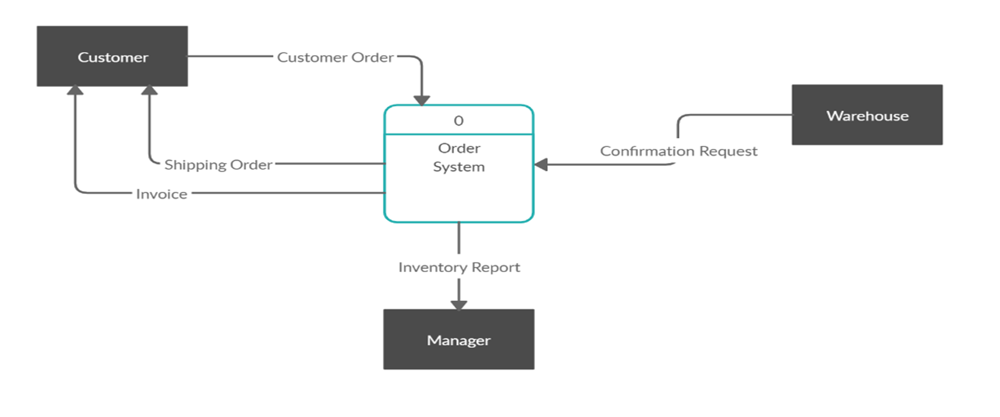
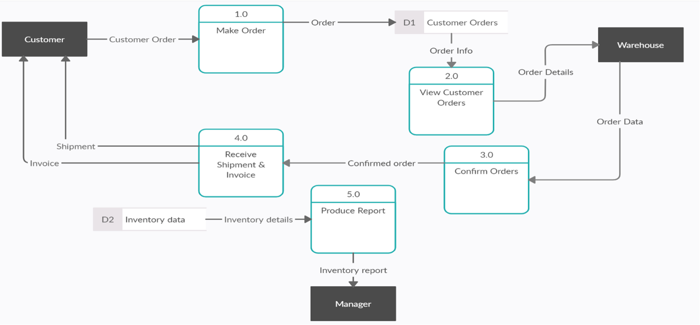
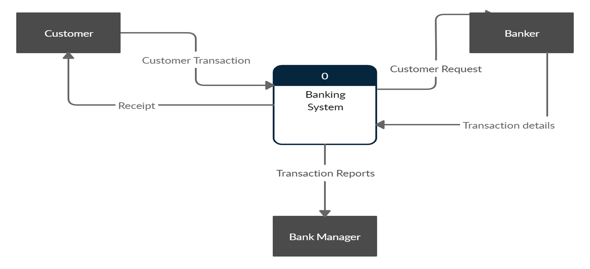
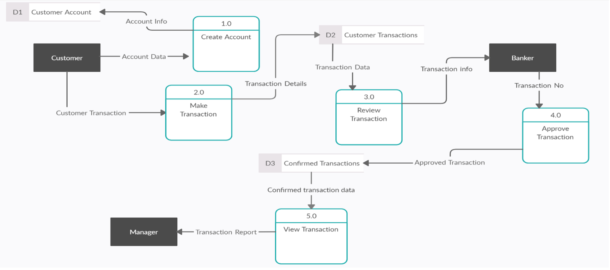
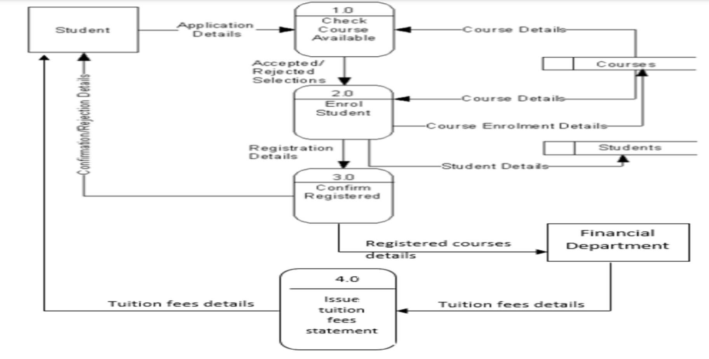

# Section 3

### Practicing time on Context Level (Level 0) & Level 1

## Case 1: Ordering System

Draw Context Diagram and level 1 for Ordering system with the functions listed below:
- The system includes Customer, Warehouse and manager as External Entities.
- The customer can make order for products and the system should store the customer order.
- The Warehouse views and confirms the customer orders.
- After the warehouse confirm the order, the customer receives shipment and invoice for his order.
- The manager can view inventory report.

### Context Diagram

### Level 1

## Case 2: Banking System

Draw Context Diagram and level 1 for Banking system with the functions listed below:
- The system includes Customer, Banker (Auditor) and  Bank manager as External Entities.
- The customer creates an account and the customer’s account is stored on the system, then he can make transactions on his account and the customer’s transaction is stored.
- The Banker review the customer’s transaction and approves it in order to store the approved transaction on the system in data store named confirmed transaction.
- The bank manager can view confirmed transaction report.

### Context Diagram

### Level 1

## Case 3: Online Registration System

Level 1 DFD for the Online Registration System for university 
1. First, the student sends an application form that contains his personal details and the desired courses. 
2. The university system checks that each course is available. 
3. If the course is unavailable the student is sent a rejection mail. 
4. But If the course is available the student is enrolled in the course and the university system confirms this enrollment by sending a confirmation mail that contains all the registered courses. 
5. As well the university sends the student's registered course details to the Financial department, so the department calculate and issues the required tuition fees details that will be sent by the system to the student and will be paid through any online payment portal.

### Level 1

